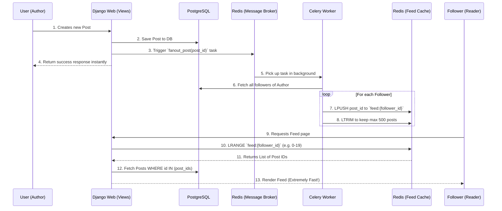

# Feed "Fan-Out on Write" Caching Architecture

Currently, when a user loads their feed, the database performs a heavy query: it finds everyone the user follows, then searches all posts by those people, and sorts them by date. This "pull" model (Fan-in on Read) becomes incredibly slow as the number of followers and posts grows.

To solve this, we will implement a **Fan-out on Write** architecture using Redis. 

## 🏗️ Architecture Diagram

## 🛠️ Proposed Changes

We will modify several components to integrate this pattern seamlessly.

### [postapp/postknob/services.py] (NEW)
Extract the core caching logic into a dedicated service layer so we don't clutter the views or models.
- Implement functions to interact directly with Redis (using `django.core.cache` or a direct `redis` client).
- `push_post_to_feed(follower_id, post_id)`
- `get_feed_post_ids(user_id, offset, limit)`

### [postapp/postknob/tasks.py]
Add background Celery tasks to handle the heavy lifting without slowing down the web request.
- `fanout_new_post(post_id)`: Fetches all followers and updates their Redis feed lists.
- `add_user_posts_to_feed(follower_id, following_id)`: When a user follows someone, grab their recent posts and inject them into the follower's Redis feed.
- `remove_user_posts_from_feed(follower_id, following_id)`: When a user unfollows someone, remove those posts from the Redis feed.

### [postapp/postknob/views.py]
Update the feed view to read from Redis instead of executing the heavy DB query.
- Modify `feed_view()` to fetch paginated post IDs from Redis, then perform a simple `Post.objects.filter(id__in=ids)` and re-order them in Python.
- Update `follow_toggle()` to trigger the follow/unfollow Celery tasks.

### [postapp/postknob/signals.py] (NEW)
Hook into the Post creation and deletion process.
- On `Post` create: trigger `fanout_new_post.delay()`.
- On `Post` delete: trigger a task to remove the ID from follower feeds.

## ⚠️ Open Questions & User Review Required

> [!IMPORTANT]
> **Fallback Mechanism**
> If a user's Redis feed is empty (e.g., if Redis restarts or keys expire), should we fallback to the old database query? I propose **Yes**, implementing a fallback ensures the app never breaks even if the cache goes down. Do you agree?

> [!TIP]
> **Feed Limit**
> To save memory in Redis, it is standard practice to cap the cached feed size (e.g., keep only the latest 500 posts per user in memory). Is a 500-post limit acceptable for the cache? (Older posts would still exist in the database, just not immediately in the personalized feed).

Let me know your thoughts on the fallback and feed limits, and if you're ready for me to build this!
